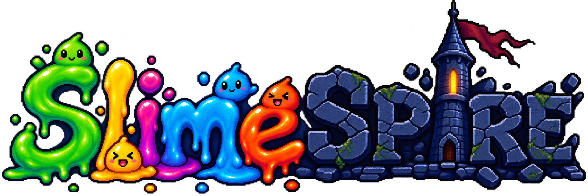
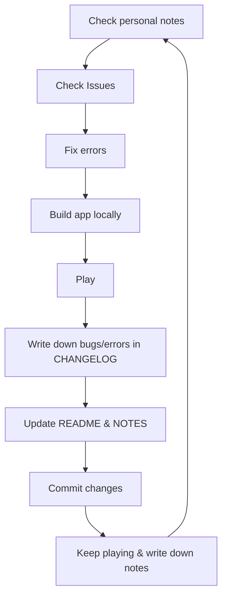

  

---

# A-Lua-Rougelike
Development of my first game ever: a strategy-combat rougelike that (hopefully) can be played up until the engine unalives itself. Yes, this game is very much based on other rougelikes, like **Balatro**, **Soul Knight**, **Pawnbarian**, **Slice & Dice**, etc.
Something to pull out while waiting for food at a restaurant, in the bathroom, during a flight, or whenever you want, even without internet.

**IMPORTANT: THIS IS NOT A SERIOUS GAME, SO DON'T GET MAD WHEN YOU SEE THE PLAYER CHARACTER**

<!-- version-start --> 
v0.1.9
<!-- version-end -->

## Releases & Betatests **`C`**
Everytime a new version is published, the repo will generate a folder with:

> Game file (.app or .exe),
> NOTES.pdf,
> README.txt,
> betatest_notes.txt

Both `.app` & `.exe` have all files needes for the game to run, so please don't add anything to them
NOTES must not be altered with, since it already has enough info & the repo serves as a bonus
Both `.txt`files are meant to be changed and overwritten, with a few especifications:
* `README.txt` is a lightweight introduction to the game, yet it's so prone to change it's easier to leave it as a plain text
* `betatest_notes.txt` is where all your findings/opinions will reside. If you write anything here, be sure to keep track of when, where & how you found everything. This will also serve a how you'll write the Issue, if you feel like it & want to.
As of now, betatesting is public **& not renumered in any way**, so if you want to help make this a more polished game, you're more than welcome to!

## Vision
What I seek to achieve with the game goes beyond mere knowledge. I want to build a good enoguh portfolio for future reference, try and get connections and most importantly, demonstrate how a mere random dream can become your future, reality, AND legacy if you give it your all! That and posibbly make a quick buck or two when the game is released for sale :3

## Changes
It's almost a garantee that this README will be changing constantly, so don't be surprise if it looks way different from what you remember. Stuff prone to change will have this tag in their header text: **`C`**

## Workflow
The game follows this workflow:

## Story **`C`**
There isn't lore or story here, atleast for now. But if you really want something to go off of:
> **You've been wondering the woods for years, searching for a way back home. You come across a trail of slimey fluids, leading to a tower. After following it, you end up at the Slime Tower, the one from the tales, it's said to go up to the gods's realm and beyond, with no reward or treasure. Tempted by the idea of brutally killing slimes, you enter. Once inside, all of your equipment is teleported to a shop nearby a campfire, and you feel you strength fade in an instant. Also, you notice your body became a humanoid amalgamation of weird shapes, but you didn't consider it as important as getting back your stuff.**
**As you advance to the campfire, a sign pops up: "Welcome, unfortunate soul!! You've been inflicted with an uncurable curse, desowning you of your belongings as well as screwing up your body. I'm tired so let's cut to the chase: Reach Floor 20, defeat the Ruler, and I'll remove the curse. And no, you cannot exit until you either die or reach me. Good luck ;)".**
**After reading it, the sign combusts, turning into 100 gold. With the goal of getting back your stuff, kill slimes, and avoid having to pay your taxes, you head to the campfire to rest, with the stairs to the first floor behind, and prepare to ascend the tower**

Feel free to add whatever to this base story. Maybe I'll add some lore in the futuro trough the game itself. Also yes, the whole body bit is how I justify the goofy looney design

## Gameplay **`C`**
ALR plays out like a standard cmd adventure game, with this base loop:
> You set a campfire and choose to buy stuff, equip items, or quit the game
> After getting (& equipping) everything, you go to the next floor
> You fight the slime(s) thta inhabit the floor
> You either lose and go to the game over screen, or you win and set a campfire
During your fights, you are given 5 options:
* Attack (Weapon)
* Defend (Shield)
* Spells (Varies for each spell, elemental attributes)
* Potions (Recover HP/Mana)
* Flee (**FLEEING A BATTLE IS THE SAME AS LOSING IT**)
After winning your first run (beating floor 20), you'll be able to flee and unlock charms, which are modifiers to make runs more interesting. You can't choose more than 1 charm per run, but some advanced charms are a combination of preivous ones, so see them as tests of your abilities and understanding of the game rather than just completion. To unlock the next tier of charms, you must complete a run with all charms from your current tier. After unlocking the last charm, you can consider the game 100% completed! (For now, atleast...)
As of now there's no almanac or index for slimes, weapons, spells, etc etc, so it's REALLY suggested that you save up for the stronger equipment (you'll need it)

## Assets & Code **`C`**
### **PLEASE READ WITH CARE, ANY AN ALL OPINIONS ON THIS REGARD MAY BE LEFT ON THE REPO**
I will come clear with something right now: part of the code was rewritten, checked, and fixed with the use of AI, as well as the logo. All base codes are hand-written, hand-checked, and tested in a local version of the game, plus some trusted friends.
Everything else (ost, sprites, sfx, etc) are 100% human slop. Although I also quite enjoy coding, my lack of both time and professionalism limit me. Yes, I have knowledge in Lua and I keep on studying everytime I find a roadblock during codebuilding. Oddly enough, the rest of the assets I'm not very familiar with, since I had never done sprites, or compose simple tracks, thus why I decided to do them all by hand, despite the flaws they have.

## Opinions, discussions, help, & more **`C`**
If you have any tip, comment, idea, or whatever that you would like to share, feel free to put them in the Issues section of the repository. For personal reasons, I do not accept DMs in any platform or email, plus I'm able to keep the game as transparent as possible. Please follow these rules if you wish to publish anything:
* **Respect each other:** Avoid using any type of speech that may incite hate or violence
* **Be direct:** I know sometimes context is needed, but please try and keep the suggestions as simple as possible. If you're able to write them as a list, even better (plus they're more likely to be taken in account). As for normal convos, try to keep them in the same Issue, and if it's neccesary, make another one
* **NO NSFW:** Yes. I know it's absurd to put this here. I'm not taking chances. If you want to draw NSFW based on the game, do it. Just, please keep it outside of here. **IMPORTANT: I DO NOT CONDONE ANYTHING DONE, SHOWN OR SAID IN ANY AN ALL PIECE OF ART MADE, UNLESS I EXPLICITLY SAY IT**
* **HELP:** If you get stuck, suffer a bug, crash, etc, and there seems to be no help from others, please make an Issue addresing the error, and wait till someone's able to read it. All Issue that aren't asnwered or fail to be resolved in a week will be deleted. I'll try to answer as many as I can, but bear in mind, I'm still in college and have other stuff to attend to!!

## Support **`C`**
Any and all support is very much appreciated, even if it's just a star or comment!! I don't expect much since this is only the beta and alpha releases for Windows & macOS (Linux support soon!11!11!1!). Sorry mobile gng, you'll be missing out for a while. **As for now I'm doing this as a passion project, so don't look for employment or anything related (saying this just in case)**. And ofc, playing it and enjoying the goofiness of it is what I truly hope you all can do!! <3

## Contributing
As you can probably tell, the whole game is (most likely) gonna be developed by me, myself and I. Why? Because I enjoy suffer and all nighters. But yeah, maybe I'll seek help in the sprites and ost when I see it fit
